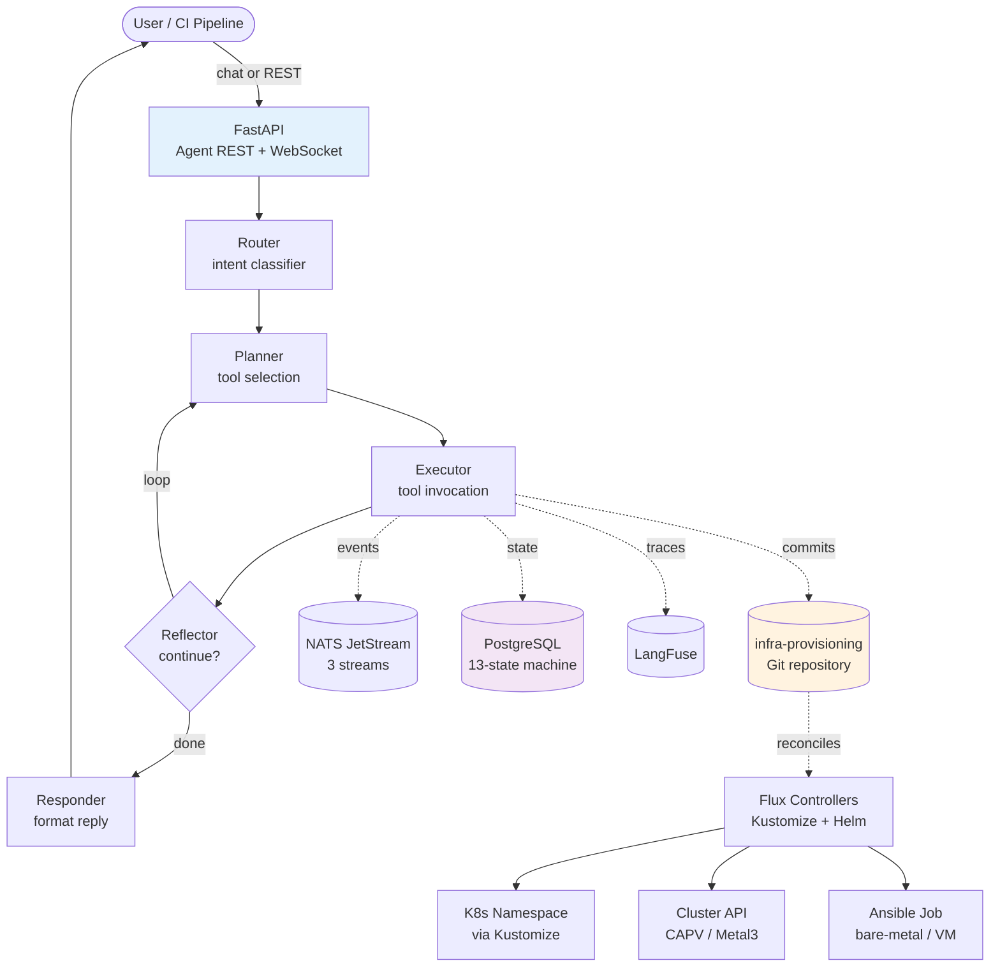
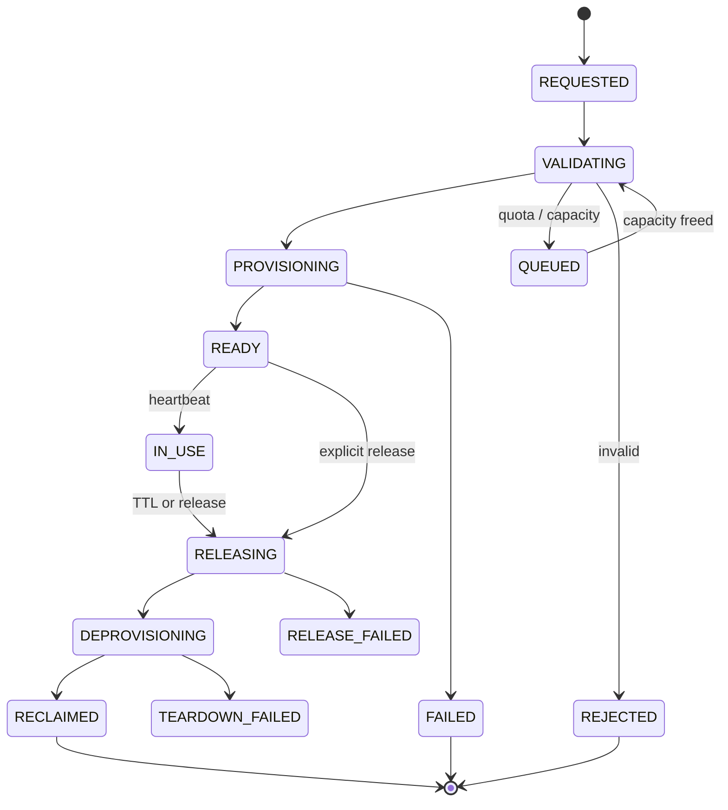

# Architecture

The platform is a layered system: a conversational LLM agent on top, GitOps
reconciliation in the middle, and three provisioning layers (Kubernetes
namespaces, Kubernetes clusters via CAPI, and bare-metal/VM via Ansible) at
the bottom.

## High-level system view



## Four layers

### 1. Conversational layer (FastAPI + LangGraph)

The agent is a LangGraph state machine with five nodes:

| Node | Responsibility |
|------|---------------|
| **Router** | Classify user intent (provision / release / extend / diagnose / query / chat). Fast keyword matcher with LLM fallback for ambiguous cases. |
| **Planner** | Decide which tools to invoke. Hybrid: deterministic for well-known intents, LLM-driven for free-form queries. |
| **Executor** | Run the tools. 30 total tools; only 19 are exposed to the LLM (the other 11 — GitOps writes, namespace deletion, secret encryption, NATS events — are reserved for the deterministic provisioner to prevent hallucinated infrastructure changes). |
| **Reflector** | Decide whether to loop back to planner or proceed to responder. Hard cap at 20 iterations. |
| **Responder** | Format the final response. |

State is persisted to PostgreSQL via `langgraph-checkpoint-postgres` so a
killed agent pod resumes mid-flight.

#### Service classes (v0.21.0 SOLID refactor)

The route handlers (`chat.py`, `reservations.py`) and the FastAPI
lifespan are intentionally thin — non-trivial logic lives behind
focused service classes in `src/api/services/`, `src/api/lifecycle.py`,
`src/api/nats_consumer.py`, `src/agent/parsers.py`, and
`src/state/machine.py`:

| Class | Pattern | Role |
|-------|---------|------|
| `ResponseBuilder` | Extract Class + DI | Compose the chat/stream response from a graph result + injected continuations |
| `ProvisioningResultParser` / `ProvisioningOrchestrator` | Parser + Value Object | Turn `tool_outputs` into a typed `ProvisioningRequest`, dispatch to the deterministic provisioner, return a `ProvisioningSummary` |
| `ReservationReleaseService` | Facade + DI | Compose DB lookup + state advancement + (BM-only) NetBox cleanup for the post-`delete_from_gitops` continuation |
| `ReservationStateMachine` | State Machine | OO facade over the transition table; `plan_release()`, `plan_release_finalization()`, `find_path()` BFS |
| `InfrastructureCleanupService` | Strategy + Composite + DIP | `CleanupStep` protocol with `GitOpsCleanup` / `VsphereVmCleanup` / `KubernetesSecretCleanup` concrete steps |
| `LifecycleManager` | Composition + Builder | 9 startup phases; `start(app)` composes them, `stop()` unwinds |
| `NatsConsumer` / `NatsEventParser` / `ReservationReclaimedHandler` | Strategy + DI | NATS JetStream subscription with parsed-event dispatch |
| `ResourceSpecParser` | Parser + Value Object | Free-form English → `ProvisionSpec(env_type, ResourceSpec)` |
| `GitConflictResolver` | Extract Class | Encapsulates fetch + reset + reapply for rejected GitOps pushes |
| `DatabaseContext` | Service Locator | Injectable `session_factory` + `env_id_generator` for unit tests |

Adding new behavior (e.g. another infrastructure backend, another NATS
event subject, another LLM-judge rubric) is a new class plus
registration — the existing classes are not modified (Open/Closed).

### 2. GitOps reconciliation (Flux + Kustomize + Helm)

The agent never touches the live cluster directly for provisioning. It
**commits** to `infra-provisioning`, and Flux reconciles. This keeps the
source of truth in Git and makes every change auditable.

- 7 Flux `Kustomization` resources: `flux-system`, `infrastructure`,
  `apps`, `environments`, `capi-clusters`, `capi-addons`, `ansible-runner`
- 11 `HelmRelease` resources: PostgreSQL, NATS, Sealed Secrets, Jenkins,
  OpenSearch, OpenSearch Dashboards, SonarQube, kube-prometheus-stack,
  Fluent Bit, NetBox, LangFuse
- 9 `HelmRepository` sources (NATS, Jenkins, OpenSearch, SonarQube,
  Prometheus community, Fluent, etc.)

`prune: true` on the `environments` Kustomization means deleting the
overlay folder from Git deletes the environment in the cluster.

### 3. Provisioning layers (3 patterns)

| Pattern | Use Case | How |
|---------|----------|-----|
| **K8s namespace** | Lightweight test envs (most common) | Kustomize overlay → Flux reconciles → `Namespace` + `ResourceQuota` + `NetworkPolicy` + `RBAC` |
| **K8s cluster (CAPI)** | Cluster-scoped tests, multi-tenant isolation | `Cluster` + `KubeadmControlPlane` + `MachineDeployment` + `VSphereCluster` + IPAM `InClusterIPPool` + Calico CNI via `ClusterResourceSet` |
| **Bare-metal / VM** | OS-level testing, kernel modules, IPMI flows | K8s Job runs `ansible-runner` image → Ansible vSphere collection clones from template on vCenter (uses `/api/`, not `/rest/`) |

### 4. Observability + reporting

- **Prometheus + Grafana** — RED metrics for the agent + standard
  kube-prometheus-stack
- **OpenSearch + Fluent Bit** — container logs, audit logs, application
  logs; ISM lifecycle policy (hot 30d → warm → delete 365d)
- **LangFuse** — LLM trace, token, cost tracking with `env_id` correlation
- **SonarQube** — code coverage and quality gates from CI
- **Jaeger (OpenTelemetry)** — distributed traces across agent + tools

All five share the **`env_id`** correlation key so you can pivot from a
metric to a log to a trace for the same environment.

## State machine (13 states)



Background services watch the state machine:

- **TTL supervisor** — warns at 80% TTL, auto-releases at 100% (60-second tick)
- **Heartbeat monitor** — releases on 2× heartbeat timeout (30-second tick)
- **Orphan detector** — reconciles state store vs GitOps directories every
  15 minutes; force-cleans CAPI clusters stuck in `Deleting` for >15 min
- **Queue processor** — re-evaluates `QUEUED` requests when an
  `environment-released` event hits NATS

## 3-tier LLM routing

```
┌─────────────┐     fallback     ┌────────────┐     fallback     ┌─────────┐
│ Tier 1      │ ──────────────▶  │ Tier 2     │ ──────────────▶  │ Tier 3  │
│ Local LLM   │                  │ OpenRouter │                  │Anthropic│
│ (SSO)       │                  │            │                  │ Claude  │
└─────────────┘                  └────────────┘                  └─────────┘
   gpt-oss-120b                  openrouter/free                  claude-sonnet-4
   langchain-openai              langchain-openai                 langchain-anthropic
```

All three speak the same `.bind_tools()` API, but Anthropic is invoked via
its **native** Messages API (not the OpenAI compatibility shim — that has
known function-calling quirks for chained tool use). The SSO token for the
local LLM flows through `RunnableConfig["configurable"]["sso_token"]` so
LangGraph nodes can forward it to nested LLM calls.

## RBAC

5 roles, 11 permissions:

| Role | Can do |
|------|--------|
| platform-admin | All 11 permissions |
| team-lead | CREATE, VIEW (own + team), RELEASE_OWN, PREEMPT, EXTEND_TTL, AUDIT_VIEW_OWN |
| developer | CREATE, VIEW_OWN, RELEASE_OWN, AUDIT_VIEW_OWN |
| ci-service | CREATE, VIEW_OWN, RELEASE_OWN, AUDIT_VIEW_OWN |
| viewer | VIEW_OWN, VIEW_TEAM |

Auth is header-based (`X-User`, `X-Role`, `X-Team`) at the proxy edge,
enforced by FastAPI middleware + `@require_permission(...)` decorators.
LLM tool access is further restricted via an `LLM_TOOLS` allowlist
(19 of 30 tools).

## Key design decisions

- **State store > infra-provisioning > live cluster** — when they disagree,
  the database is right; the orphan detector reconciles the rest.
- **vSphere `/api/` only** — `/rest/` wraps everything in `{"value": ...}`
  and has broken filtering. vCenter 7.0+ exposes `/api/` natively.
- **Flux paths under `clusters/`** must contain only valid Kubernetes YAML.
  Non-K8s files (READMEs, scripts) cause reconciliation failure.
- **Kubeadm clusters need namespace pre-creation** before HelmReleases
  target them. Pre-managed K8s often auto-creates namespaces; kubeadm
  doesn't.
- **`Secret envFrom` overrides `ConfigMap` keys** — empty Secret values
  silently override ConfigMap values. Never leave placeholder Secrets
  with empty keys that exist in a ConfigMap.

[Phase status →](phases.md){ .md-button }
[Test Automation →](test-automation.md){ .md-button }
